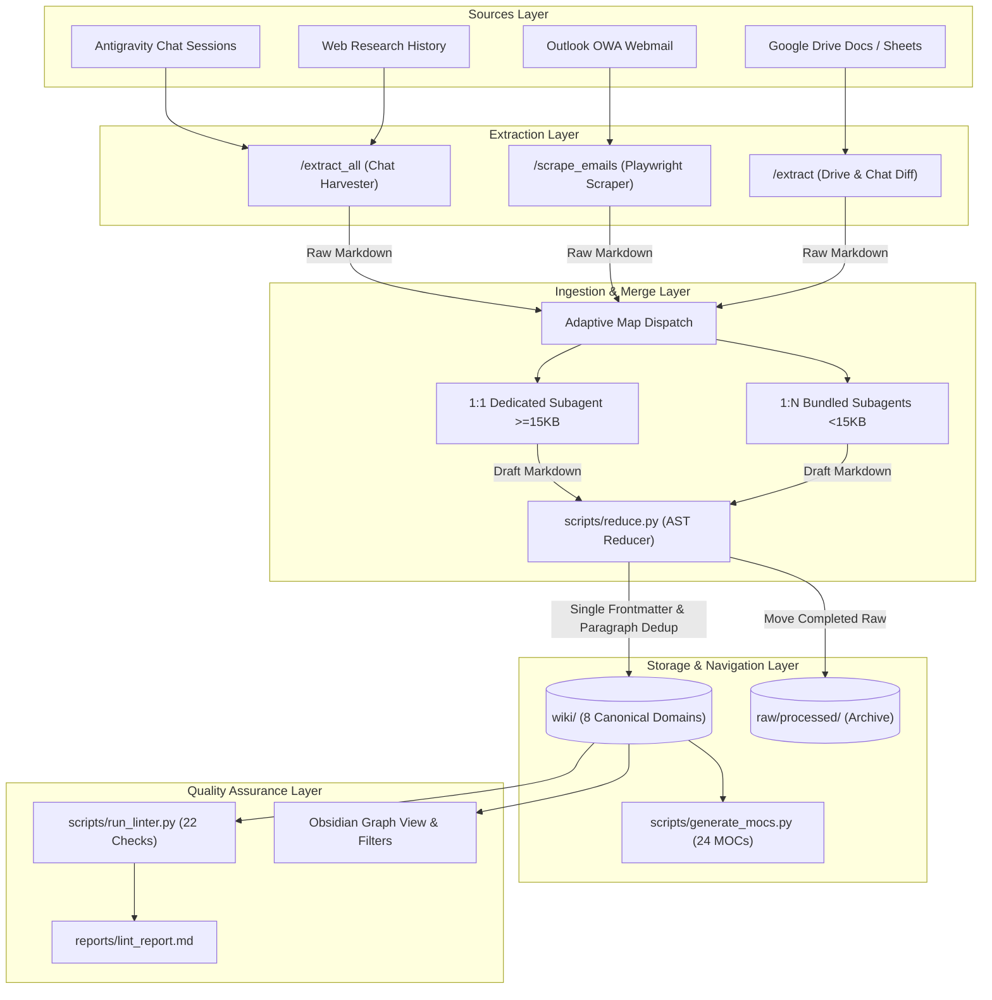

# LLM Wiki & Knowledge Graph System (Antigravity 2nd Brain)

A fully autonomous, self-healing Personal Knowledge Base and Knowledge Graph engineered for academic research, neurotechnology, organizational psychometrics, and career development. Powered by **Google Antigravity AI Agents**, **Python AST processing engines**, and **Obsidian Graph View**.

---

## Table of Contents
1. [System Overview & Architecture Philosophy](#1-system-overview--architecture-philosophy)
2. [Canonical 8 Root Domains Architecture](#2-canonical-8-root-domains-architecture)
3. [End-to-End Pipeline & Data Lifecycle](#3-end-to-end-pipeline--data-lifecycle)
4. [Command Skills Specification (7 Skills)](#4-command-skills-specification-7-skills)
5. [The 22-Check Deterministic Linter Catalog](#5-the-22-check-deterministic-linter-catalog)
6. [Obsidian Graph View & UI Configuration](#6-obsidian-graph-view--ui-configuration)
7. [Directory Tree & System Structure](#7-directory-tree--system-structure)
8. [CLI Execution Guide & Maintenance Workflows](#8-cli-execution-guide--maintenance-workflows)

---

## 1. System Overview & Architecture Philosophy

The **LLM Wiki Project** is a production-grade personal knowledge management (PKM) system that continuously converts raw conversations, cloud documents, academic papers, and enterprise communications into a structured, bidirectional knowledge graph. It is maintained autonomously by Antigravity multi-agent swarms operating under strict deterministic engineering constraints.

```
┌──────────────────────────────────────────────────────────────────────────────────┐
│                             ANTIGRAVITY 2ND BRAIN                                │
│                                                                                  │
│   [Raw Sources]            [AI Agent Swarm]              [Knowledge Graph]       │
│  • Agent Chats (840+)    • Ingest Mappers (1:N, 1:1)   • 8 Canonical Domains     │
│  • Google Drive Docs     • Knowledge Hunters           • 24 Maps of Content      │
│  • Outlook Emails        • AST Reducer Engine          • Bidirectional Wikilinks │
│  • Web Crawl History     • 22-Check Python Linter      • Obsidian Visual Graph   │
└──────────────────────────────────────────────────────────────────────────────────┘
```

### Core Engineering Directives
1. **English-Only Standardization (Rule 01.3)**:
   - All knowledge base notes must be written exclusively in professional technical English. Raw conversation transcripts in native languages are synthesized and translated into technical prose upon ingestion.
2. **Deterministic Routing & Flat Hierarchy (Rule 01.1 & 01.5)**:
   - File placement is determined by canonical type overrides and Level-2 taxonomy categories. Folder nesting is strictly capped at a maximum depth of 2 levels below `wiki/` (e.g., `wiki/academic/eeg/`). Creating directories outside the 8 canonical domains or with spaces is strictly prohibited.
3. **Ghost Node Eradication (Rule 04.5)**:
   - Obsidian's Graph View generates unresolved "ghost" nodes whenever target files do not exist or when raw source filenames are enclosed in wikilinks. Raw assets (e.g., `email_*.md`, `chat_extract_*.md`) must **never** be linked via `[[...]]`. They are cited as plain text strings in frontmatter `sources:` lists and markdown body `## Sources` sections.
4. **Dual-Layer Hygiene & Prevention Architecture**:
   - **Layer A (AI Prompt Rules)**: Strict behavioral directives in `.agents/rules/` that enforce single frontmatter blocks, entity grounding anchors, and plaintext citations at generation time.
   - **Layer B (Deterministic AST Python Engine)**: `reduce.py` and `run_linter.py` parse YAML abstract syntax trees, merge set-union properties, and hash paragraphs to eliminate duplicates before committing.

---

## 2. Canonical 8 Root Domains Architecture

The wiki is organized into exactly eight canonical root directories under `wiki/`. Creating folders with spaces (e.g., `personal projects/`, `computer science/`) or unapproved root directories is blocked by Check 22 of the system linter.

| Domain | Scope & Knowledge Focus | Subfolder Structure | Representative Notes |
| :--- | :--- | :--- | :--- |
| **`academic/`** | Neuroscience, EEG signal processing, BCI theory, psychometrics, UCL & OU academic modules. | `eeg/`, `hybrid/`, `psychology/`, `survey/`, `ucl/`, `citi/`, `google/`, `reading_notes/` | `Brain_Computer_Interface.md`, `EEG.md`, `Psychometrics.md`, `University_College_London.md` |
| **`business/`** | Organizational behavior, management science, enterprise AI strategy, corporate dossiers. | `samsung/` | `Samsung_AI_Center_Cambridge.md`, `Overcome.md`, `Academy_Of_Management.md` |
| **`career/`** | Target laboratory profiles, CV/resume master dossiers, interview preparation strategies. | *(Top-level flat)* | `Kyubin_Yun_Resume.md`, `Target_Companies_Dossier.md`, `Internship_Interview_Prep_Full.md` |
| **`dev/`** | Software engineering, multi-agent frameworks, Playwright scraping, data pipelines. | `ai/` | `Accessibility_Tree_Parsing.md`, `Computer_Understanding.md`, `GitHub_Development_Browsing_History.md` |
| **`people/`** | Academic collaborators, professors, research directors, recruiters (`type: person`). | *(Top-level flat)* | `Kyubin_Yun.md`, `Jeongjin_Kim.md`, `Pok_Man_Tang.md`, `Dimitrios_Adamos.md` |
| **`personal/`** | Technical study notes, remote exam protocols (OPIc), educational milestones. | *(Top-level flat)* | `Definition_Of_Prevalence.md`, `Taking_The_Opic_Exam_Online_Via_Remote_Proctoring_In_The_Us.md` |
| **`projects/`** | Active engineering and academic research initiatives led by Kyubin Yun. | `eeg/`, `internships/`, `personal-projects/`, `research-projects/` | `Boundary_Spanning_Meta_Analysis.md`, `Eeg_Smart_Glasses_Interface.md`, `Adhd_X_Mfc_Project.md` |
| **`tools/`** | Hardware platforms, ambient recording devices, PKM tools, experimental software. | *(Top-level flat)* | `Obsidian_Second_Brain_Architecture.md`, `Wearable_Ai_Recording_Devices.md`, `Playwright.md` |

---

## 3. End-to-End Pipeline & Data Lifecycle

The system implements a continuous data lifecycle moving from raw ingest queues to permanent structured storage and automated quality assurance.



### Data Lifecycle Transitions
1. **Raw Ingestion Queue (`raw/assets/`)**:
   - Newly extracted files (`chat_extract_*.md`, `email_*.md`, `drive_doc_*.md`) land here. Files remain here only while awaiting ingestion.
2. **Knowledge Base (`wiki/`)**:
   - The permanent repository of structured knowledge. Every page adheres strictly to `schema.yaml` and contains bidirectional wikilinks to related concepts.
3. **Permanent Archive (`raw/processed/`)**:
   - Upon successful ingestion and reduction by `reduce.py`, raw source files are moved out of the queue into `raw/processed/` to guarantee idempotency and prevent duplicate processing.
4. **Incremental Logs (`raw/imports/`)**:
   - Maintains diff tracking logs: `.extract_all_log.json` (indexed chat IDs), `.drive_scan_log.json` (Google Drive file checksums), and `.extract_emails_log.json` (scraped email message IDs).

---

## 4. Command Skills Specification (7 Skills)

All operations are modularized as standard agent skills in `.agents/skills/`.

### 1. `/extract` — Incremental Knowledge Extraction
- **Trigger**: `/extract [optional: file_path | folder_path]`
- **Purpose**: Extracts structured technical information from live conversation contexts, Google Drive files, or local PDFs without premature summarization.
- **Incremental Logic**: Evaluates file hash and timestamp against `raw/imports/.extract_log.json`. If unchanged, extraction is skipped. If modified, extracts only the diff.
- **Output**: Writes immutable markdown source files to `raw/assets/`.

### 2. `/extract_all` — The Proactive Knowledge Hunter
- **Trigger**: `/extract_all`
- **Purpose**: Mass-harvests all historical conversations across Antigravity sessions and fills knowledge coverage gaps in the wiki.
- **Workflow**:
  1. Scans `C:/Users/yunky/.gemini/antigravity/brain/*/transcript.jsonl` (840+ sessions).
  2. Compares conversation IDs against `.extract_all_log.json` to process only new chats.
  3. Inspects `reports/lint_report.md` for entities flagged as "Too short (<50 words)".
  4. Spawns web research subagents with the **Entity Grounding Anchor Protocol** (`"[Entity Name]" "[Affiliation]" "[Field]"`) to harvest missing details without identity conflation.

### 3. `/scrape_emails` — Automated Outlook Scraper
- **Trigger**: `/scrape_emails`
- **Purpose**: Automates headless Chromium via Playwright (`scripts/outlook_scraper/`) to scrape emails from Outlook Web Access (OWA).
- **Newsletter Blacklist**: Automatically detects and tags automated system emails (`no-reply@*`, `Moodle`, `Students' Union`, `notifications@*`) as `tags: [email-newsletter]` to prevent spam from contaminating the knowledge graph.
- **Output**: Writes `raw/imports/outlook_emails.json`, subsequently converted to markdown files in `raw/assets/emails/` via `scripts/extract_emails.py`.

### 4. `/ingest` — Adaptive Map-Reduce Ingestion Engine
- **Trigger**: `/ingest`
- **Purpose**: Compiles raw markdown files from `raw/assets/` into structured, interlinked wiki pages with taxonomy routing.
- **Adaptive Dispatch Algorithm**:
  - **Large Files (≥15KB or ≥200 lines)**: Assigned a **1:1 dedicated subagent** for exhaustive deep extraction.
  - **Small Files (<15KB)**: Bundled up to **10 files per subagent** (max 50KB total payload) for optimal token throughput.
  - **Concurrency Safeguard**: Capped at **15 parallel subagents** to prevent API rate limits (`429 RESOURCE_EXHAUSTED`).
- **AST Reducer (`scripts/reduce.py`)**:
  - Parses YAML frontmatter into a dictionary using `pyyaml`.
  - Performs set union operations on `tags`, `aliases`, and `sources`.
  - Strips any incoming secondary frontmatter headers to maintain strict 1-block integrity.
  - Compares normalized 15+ word paragraphs across sections to prevent duplicate text injection.

### 5. `/lint` — Two-Phase Comprehensive Health Check
- **Trigger**: `/lint`
- **Phase 1: Deterministic Syntactic Audit**: Executes `scripts/run_linter.py` across 22 structural and advisory checks.
- **Phase 2: AI Semantic Sweep**: Dispatches subagents to inspect subfolders for semantic duplicates that evade lexical string matching and verifies taxonomy alignment.
- **Output**: Generates `reports/lint_report.md` and displays overall health status (`🟢 Green`, `🟡 Yellow`, or `🔴 Red`).

### 6. `/query` — Grounded Local Knowledge Retrieval
- **Trigger**: `/query [question]` or `/query [domain:academic] [tag:bci] [question]`
- **Purpose**: Answers technical and research inquiries strictly using verified knowledge contained inside `wiki/`. Prohibits hallucination or unverified external assumptions.

### 7. `/all` — End-to-End Autonomous Pipeline
- **Trigger**: `/all`
- **Purpose**: Executes the complete pipeline in a single automated pass:
  $$\text{Scrape Emails} \longrightarrow \text{Extract All} \longrightarrow \text{Ingest (Map-Reduce)} \longrightarrow \text{Generate MOCs} \longrightarrow \text{Run Linter}$$

---

## 5. The 22-Check Deterministic Linter Catalog

The custom Python linter (`scripts/run_linter.py`) executes 22 rigorous deterministic checks. The wiki must achieve **0 Structural Errors** to be certified as **🟢 Green Status**.

| # | Check Name | Classification | Failure Condition & Enforcement Rule |
| :---: | :--- | :---: | :--- |
| **1** | **Schema Integrity** | **Structural** | Missing any mandatory field (`type`, `title`, `description`, `tags`, `timestamp`, `sources`) from `schema.yaml`. |
| **2** | **Type Validation** | **Structural** | Note `type` is not one of the 14 valid types or misses type-specific required fields (e.g., `person` missing `role`/`affiliation`). |
| **3** | **Domain Placement** | **Structural** | Physical folder path does not match the YAML frontmatter `domain:` attribute. |
| **4** | **Staleness Check** | **Advisory** | Note has not been updated in over 90 days. |
| **5** | **Coverage Gaps** | **Advisory** | Note body has fewer than 50 words or contains non-English Korean characters (violates Rule 01.3). |
| **6** | **MOC Sync** | **Structural** | Note is not indexed in its folder's local `_moc.md` file. |
| **7** | **Orphan Check** | **Advisory** | Note has zero incoming wikilinks from other pages or MOCs. |
| **8** | **Duplicate Filenames** | **Structural** | Two or more files share identical normalized names (stripped of hyphens, underscores, case). |
| **9** | **Naming Convention** | **Structural** | Filename violates `Underscore_Separated_Title_Case` or contains spaces or illegal characters `()[]{}#%&*|\/:"<>?—.`. |
| **10** | **Tag→Folder Consistency** | **Structural** | Note tags conflict with designated subfolder mapping rules in `taxonomy.md`. |
| **11** | **Tag Normalization** | **Structural** | Tag contains uppercase letters, underscores, spaces, or non-alphanumeric characters (must be lowercase hyphen-separated). |
| **12** | **Taxonomy Alignment** | **Advisory** | Note contains tags not registered in `taxonomy.md`. |
| **13** | **_uncategorized Overflow** | **Advisory** | An `_uncategorized/` folder accumulates 3 or more files sharing the same tag (triggers auto-folder creation). |
| **14** | **Semantic Title/Alias Dups** | **Structural** | Two distinct files declare identical titles or overlapping YAML `aliases`. |
| **15** | **Merge Debris** | **Advisory** | Note body contains uncleaned merge markers (e.g., `## Merged Content`, `## Additional Sources`). |
| **16** | **Junk / Phantom Files** | **Structural** | Temporary scraper or editor debris exists (e.g., `item1.md`, `Untitled.md`, `Empty_Document_*.md`). |
| **17** | **Cross-link Poverty** | **Advisory** | Note contains zero outgoing `[[wikilinks]]` to other concepts in the vault. |
| **18** | **Content Similarity (TF-IDF)** | **Advisory** | Two notes exhibit \(\ge 88\%\) cosine similarity based on word-frequency vectorization. |
| **19** | **Broken Outgoing Links** | **Structural** | Wikilinks target non-existent files/aliases or include `.md` extensions (root cause of Obsidian ghost nodes). |
| **20** | **Multi-YAML Frontmatter** | **Structural** | Note contains more than one YAML header block (`---...---`) embedded within the markdown body. |
| **21** | **Repetitive Paragraphs** | **Advisory** | Identical normalized paragraphs of \(\ge 15\) words occur multiple times within the same file. |
| **22** | **Canonical Root Domains** | **Structural** | Root directory under `wiki/` does not belong to the 8 canonical domains or contains spaces. |

---

## 6. Obsidian Graph View & UI Configuration

To maintain visual clarity across large-scale knowledge graphs, Obsidian workspace configurations are tuned to eliminate unreferenced clutter and distinguish entity types by color.

### Exclusion Filters (`.obsidian/app.json`)
The following patterns are excluded from Obsidian's quick switcher, search index, and graph visualization:
```json
{
  "userIgnoreFilters": [
    "raw/*",
    "templates/*",
    "reports/*",
    "scripts/*",
    ".agents/*"
  ]
}
```

### Graph Physics & Color Palette (`.obsidian/graph.json`)
- **Ghost Node Suppression**: `"hideUnresolved": true` is enforced so that links without matching files do not render as hollow grey nodes.
- **Force-Directed Physics Settings**:
  - `centerStrength: 0.3`
  - `repelStrength: 15.0`
  - `linkStrength: 1.0`
  - `linkDistance: 250`
- **Node Type Color Palette**:

```
┌────────────────────────────────────────────────────────┐
│  COLOR PALETTE MAPPING BY SCHEMA TYPE                  │
│                                                        │
│  • Concept       #60A5FA (Blue)                        │
│  • Person        #F472B6 (Pink)                        │
│  • Project       #34D399 (Emerald Green)               │
│  • Tool          #FBBF24 (Amber Yellow)                │
│  • Academic      #A78BFA (Purple)                      │
│  • Business      #FB923C (Orange)                      │
│  • Overview      #F87171 (Coral Red)                   │
│  • MOC           #9CA3AF (Slate Grey)                  │
└────────────────────────────────────────────────────────┘
```

---

## 7. Directory Tree & System Structure

```
LLM_Wiki_Project/
├── .agents/                                # AI Agent Instructions & System Prompts
│   ├── AGENTS.md                           # Central Agent Customizations Index & Router
│   ├── rules/                              # Modular Behavioral Directives
│   │   ├── 01_architecture.md              # 8 Domains, Schema & English-Only Rules
│   │   ├── 02_operations.md                # Operations, Subagent Dispatch & Safety
│   │   ├── 03_routing.md                   # Deterministic Tag-to-Folder Routing (Q1-Q4)
│   │   └── 04_data_hygiene.md              # Naming, Normalization, Ghost Link Rules
│   └── skills/                             # Executable Agent Skills
│       ├── all/SKILL.md                    # End-to-end full pipeline
│       ├── extract/SKILL.md                # Single/batch source extractor
│       ├── extract_all/SKILL.md            # Pan-conversation knowledge hunter
│       ├── ingest/SKILL.md                 # Adaptive map-reduce ingest skill
│       ├── lint/SKILL.md                   # Two-phase health check & 22-check catalog
│       ├── query/SKILL.md                  # Grounded wiki question-answering
│       └── scrape_emails/SKILL.md          # Playwright Outlook email scraper
│
├── raw/                                    # Raw Source Data Layer (Immutable)
│   ├── assets/                             # Ingestion Queue (Extracted markdown)
│   ├── imports/                            # Scraped JSON & Incremental Diff Logs
│   │   ├── .extract_all_log.json           # Tracked Antigravity conversation IDs
│   │   ├── .drive_scan_log.json            # Tracked Google Drive document hashes
│   │   └── .extract_emails_log.json        # Tracked scraped email message IDs
│   └── processed/                          # Permanent Archive of Completed Raw Files
│
├── wiki/                                   # The Official Knowledge Graph
│   ├── _moc.md                             # Master Vault Map of Content
│   ├── index.md                            # Domain Catalog & Entry Point
│   ├── overview.md                         # Multi-Pillar Executive Synthesis
│   ├── log.md                              # Historical Maintenance & Operation Log
│   ├── academic/                           # Neuroscience, BCI, Psychometrics, UCL/OU
│   ├── business/                           # Management, Organizational Psychology
│   ├── career/                             # Target Lab Dossiers, Resume, Interview Prep
│   ├── dev/                                # Multi-agent AI Systems, Playwright, Pipelines
│   ├── people/                             # Researchers, Collaborators, Professors
│   ├── personal/                           # Technical Study Notes & Exam Guides
│   ├── projects/                           # Active Research Initiatives (BSMA, EEG BCI)
│   └── tools/                              # Hardware (Wearable AI) & Software Platforms
│
├── scripts/                                # Automation Engines & Deterministic Scripts
│   ├── run_linter.py                       # 22-Check Deterministic Wiki Linter
│   ├── generate_mocs.py                    # Batch Map of Content (MOC) Generator
│   ├── reduce.py                           # AST YAML & Paragraph-Dedup Merge Reducer
│   ├── extract_emails.py                   # JSON to Markdown Email Converter
│   ├── extract_all_chats.py                # Historical Antigravity Chat Harvester
│   └── outlook_scraper/                    # Headless Playwright Browser Scraper
│
├── reports/                                # Linter Reports & Health Audits
│   └── lint_report.md                      # Detailed Report Generated by run_linter.py
│
├── schema.yaml                             # Strict SSOT YAML Schema Specification
├── taxonomy.md                             # Controlled Tag Vocabulary & Routing Map
└── README.md                               # Production Technical Specification
```

---

## 8. CLI Execution Guide & Maintenance Workflows

All maintenance commands can be executed directly from PowerShell or Bash within the project directory.

### 1. Run Complete Quality Assurance (22 Checks)
```powershell
# Run the deterministic linter
python LLM_Wiki_Project/scripts/run_linter.py
```
*Outputs detailed diagnostic breakdown to `reports/lint_report.md` and displays health status in terminal.*

### 2. Batch Regenerate All Maps of Content (MOCs)
```powershell
# Rebuild all 24 local and root _moc.md files
python LLM_Wiki_Project/scripts/generate_mocs.py
```

### 3. Run Email Ingestion Pipeline
```powershell
# Step 1: Scrape new emails (requires Outlook session cookies)
node LLM_Wiki_Project/scripts/outlook_scraper/scrape.js

# Step 2: Convert scraped JSON into individual markdown files in raw/assets/emails/
python LLM_Wiki_Project/scripts/extract_emails.py
```

### 4. Git Synchronization Protocol
```powershell
# Check staged changes
git status -s

# Commit modifications with semantic versioning tags
git add -A
git commit -m "feat(wiki): ingest new research notes and synchronize MOCs"

# Push to primary remote repository
git push origin main
```

---

## 9. License & Attribution
- **Author**: Kyubin Yun (Department of Psychology and Language Sciences, University College London)
- **Engine**: Google Antigravity Advanced Agentic Coding Swarm
- **Repository**: [https://github.com/canadaofbin-netizen/LLM-WIKI---personalized](https://github.com/canadaofbin-netizen/LLM-WIKI---personalized)
- **License**: MIT License. All rights reserved.
